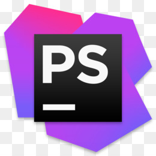

## 2.1 Editor de Texto

Como a abordagem do curso será a parte básica do PHP, não será necessário o uso de uma IDE robusta, então utilizaremos o editor de texto VSCode para realizarmos os nossos códigos, existem outras opções como SublimeText, Brackets e etc. Então fiquem a vontade para utilizarem o editor que se sentirem mais confortáveis e realizar os códigos que serão apresentados ao longo do curso.

### Visual Studio Code

<a href="https://code.visualstudio.com/download"> Clique aqui para fazer o Download </a>

Vamos começar a equipar nosso editor de texto com o que achamos ser necessário pra ajudar no desenvolvimento ágil com o PHP.
Lembrando que esses plugins **NÃO** impactam no desenvolvimento em si, apenas facilitará pro código ser lido e entendido por você.

#### PHP IntelliSense

O IntelliSense provê uma leitura precisa das classes/funções com seus parametros e te dando uma melhor visão do que é preciso pra ser chamado e com isso te dando uma "documentação" da função sem precisar ir de fato um manual pra te auxiliar.

#### phpfmt - PHP formatter

Quando estamos no periodo de aprendizado, não sabemos qual é o padrão ou "jeito" certo de deixar o que escrevemos. E sim, existe um jeito certo e tem um documento falando sobre clicando <a href="#">aqui</a> porém enquanto não chegamos nesse ponto iremos usar um formatador de código já existente para auxiliar no nosso desenvolvimento.

### PHPStorm (MELHOR IDE DO MUNDO PRA PHP)

PHPStorm é atualmente a melhor ferramente para produzir código PHP pois ela foi desenvolvida exclusivamente para uso da linguagem, porém é uma ferramenta paga e custa muitos dólares.

Porém se você é estudante de alguma instituição que forneça e-mails estudantis você pode conseguir uma licença de estudante pela JetBrains (empresa responsável pela ferramenta).

Caso você tenha um e-mail estudantil, recomendo fortemente que você procure saber se ele está elegível a conseguir essa licença e você pode saber mais <a href="https://www.jetbrains.com/community/education/">clicando aqui.</a>
