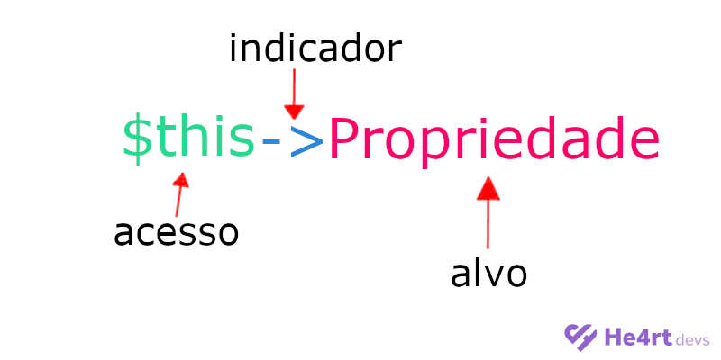
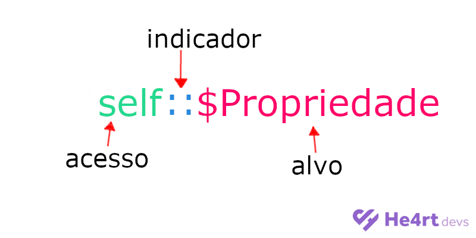

# 4.5 - Métodos Getters

## O que são?
  Os métodos getters servem para pegar a referência de um valor (geralmente de uma propriedade).
  
## Por que usar?
  Como vimos anteriormente em [4.4 - Modificadores de Acesso](4-Modificadores-de-acesso.md), temos os modificadores de acesso, e nem sempre queremos deixar
  as nossas propriedades e métodos públicos, mas se deixarmos privados como vamos acessar seu valor? podemos usar um getter. Veja o exemplo abaixo.
  
  ```php
    class exemplo
    {
      private $propriedadePrivada = "Esta propriedade não pode ser alterada nem lida diretamente";
      public $propriedadePublica = "Esta propriedade pode ser alterada e lida diretamente";
      
      
      //Esse método retorna o valor da $propriedadePrivada
      public function getterParaAPropriedadePrivada()
      {
        return $this->propriedadePrivada;
      }
    }
  ```
  No exemplo acima nós criamos duas propriedades, uma privada e uma pública. A propriedade pública pode ser lida e ter seu valor alterado, já a propriedade
  privada pode ser lida usando o método ```getterParaAPropriedadePrivada()```, porém não pode ser alterada.
  
  ## Como usar?
   Podemos usar uma palavra reservada do php ```this``` para referênciar uma propriedade da nossa classe, Veja o exemplo abaixo.
  
  

  Podemos criar uma função que retorna a referência desejada usando a palavra ```this```.
  
 ## Getters em métodos estáticos
   Ok criamos getters para as nossas propriedades, Porém esses getters só funcionam em métodos não estáticos, pois a palavra ```this``` não se aplica
   em métodos estáticos, para isso temos a palavra ```self```.
 
 
 
 Em essência nós usamos a palavra ```this``` para acessar o estado interno de um objeto, e a palavra ```self``` para acessar membros de uma definição de classe.
 
 ```php
   class Exemplo
   {
      private static $propriedadePrivada = "Esta propriedade não pode ser alterada nem lida diretamente";
      public static $propriedadePublica = "Esta propriedade pode ser alterada e lida diretamente";
      
      
      //Esse método retorna o valor da $propriedadePrivada
      public static function getterParaAPropriedadePrivada()
      {
        return self::$propriedadePrivada;
      }
   }
 ```

Ir para: [4.6 Setters](6-Setters.md)
